# Code IDE

DroidEdit redesigned UI

#### main features
- refreshed UI look
- customized fonts
- 21 themes (syntax highlighting)
- lot of syntax modes, like smali xml, html, etc (just check in app)
- hardware accelerated
- in app check update via help option

#### Screenshoots

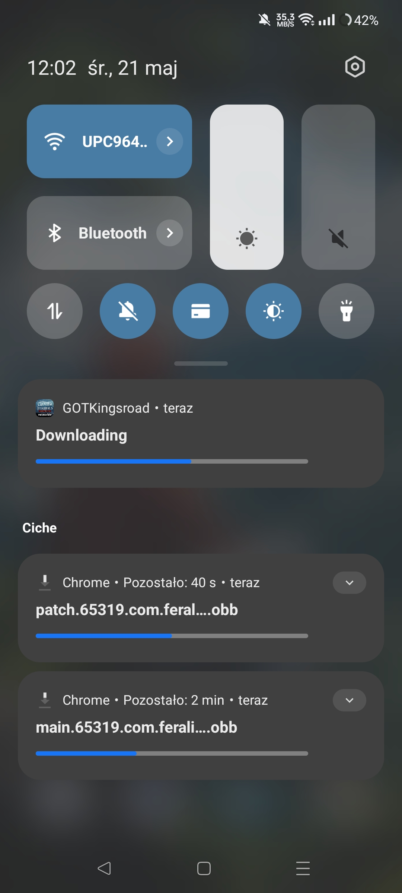
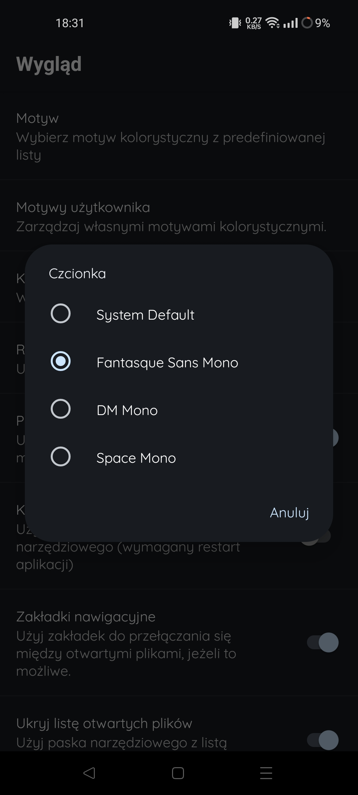
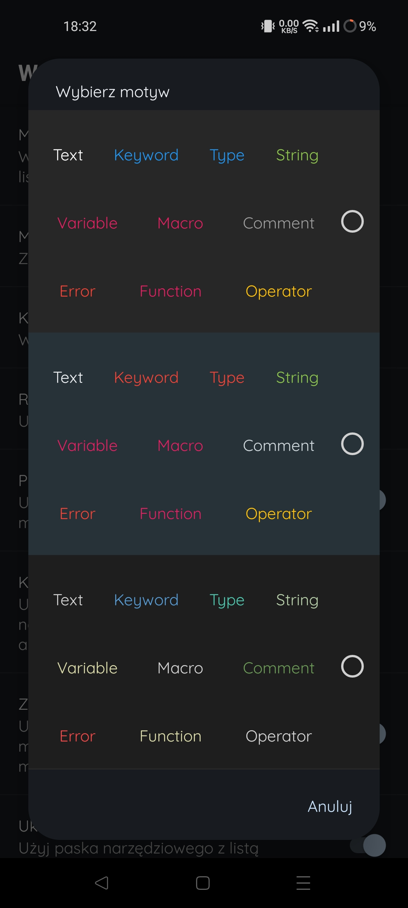
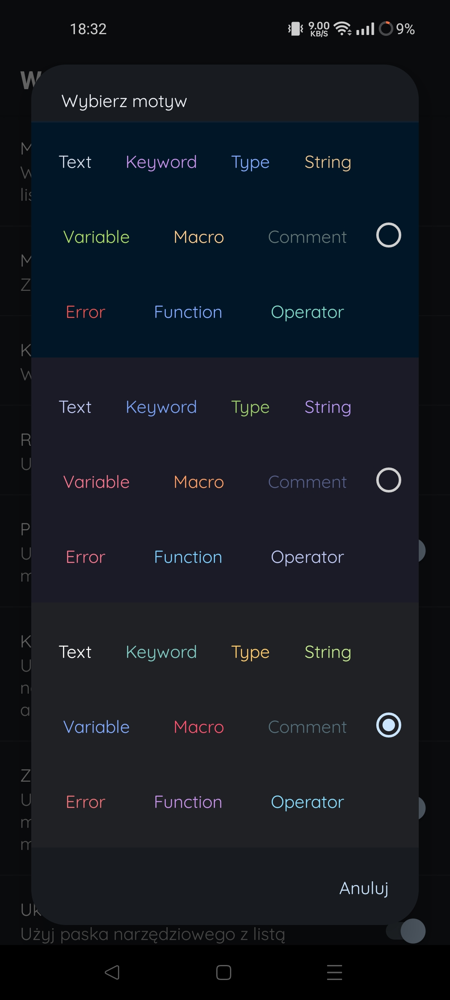
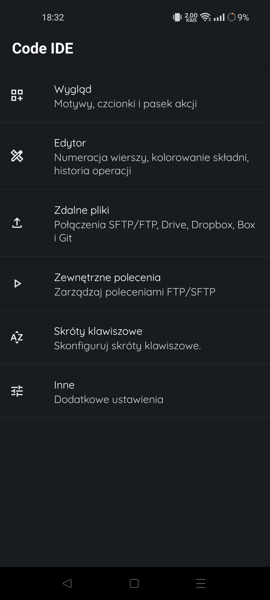
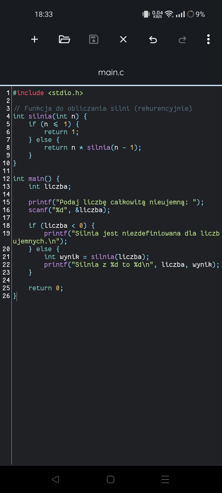
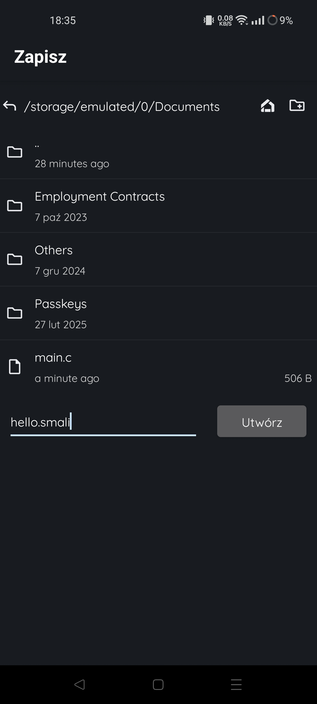
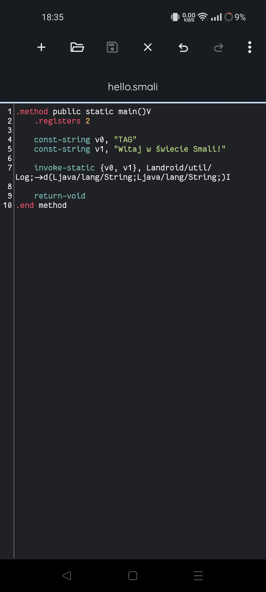
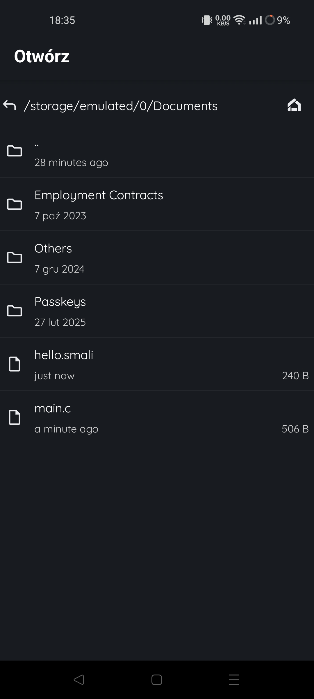
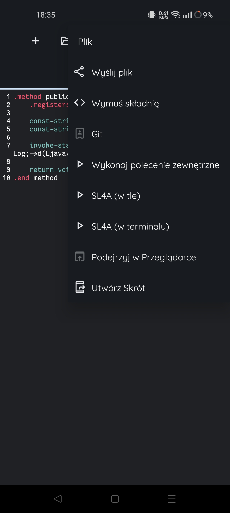
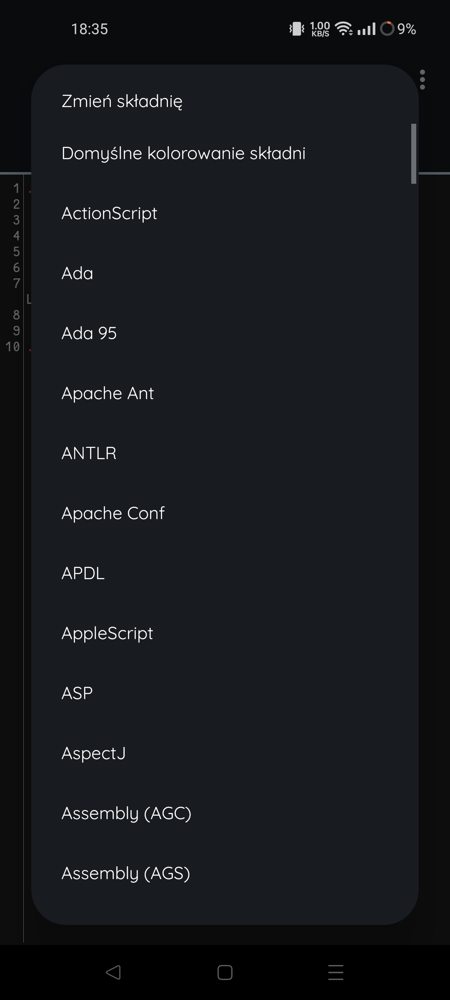
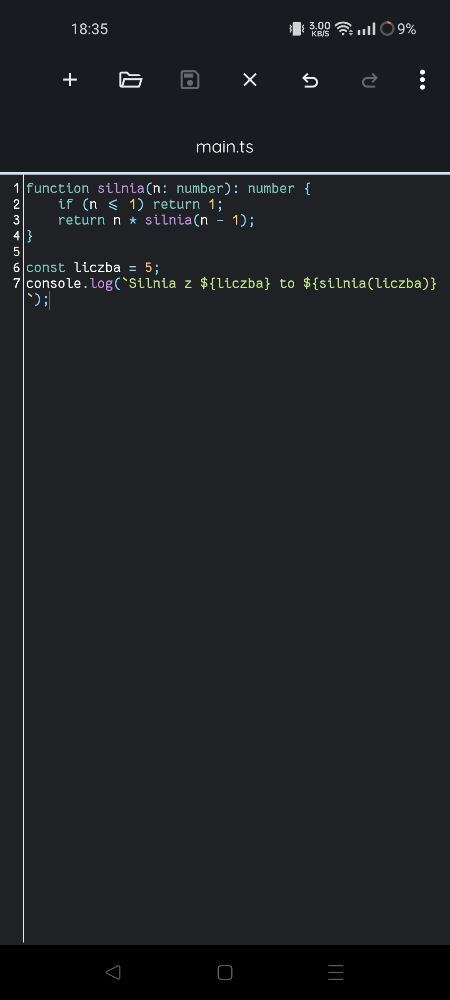
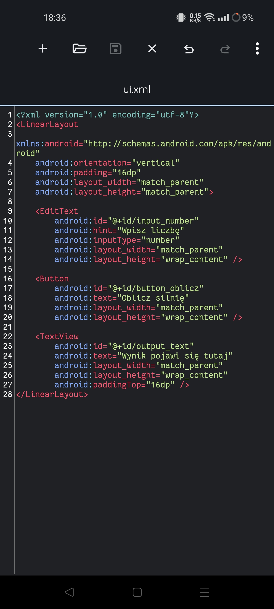